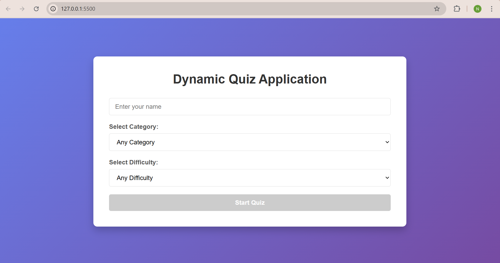
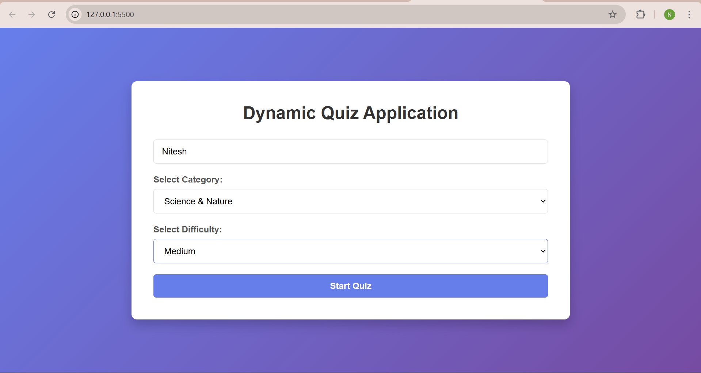
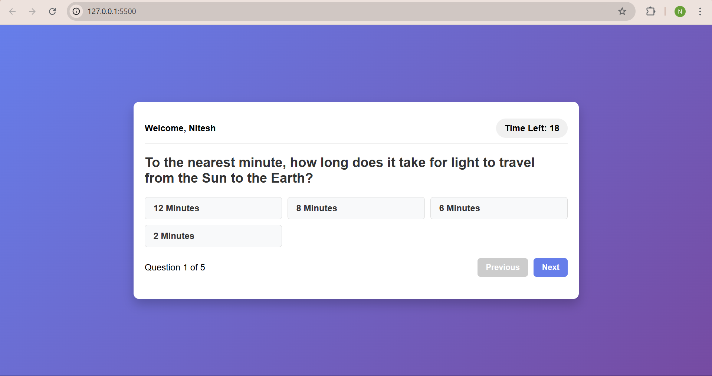
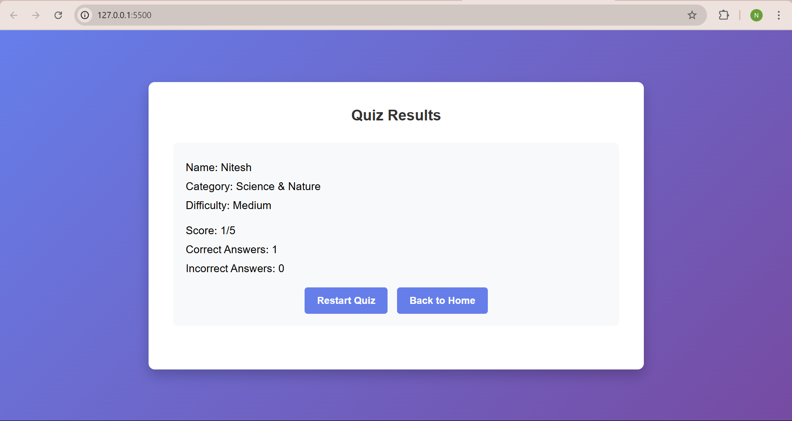

# Dynamic Quiz Application

A responsive web-based quiz application that fetches questions from the Open Trivia Database API. The application allows users to customize their quiz experience by selecting different categories and difficulty levels.



## Features

- User-friendly interface with responsive design
- Category selection from multiple topics
- Three difficulty levels (Easy, Medium, Hard)
- Timer for each question (30 seconds)
- Navigation between questions
- Score tracking and result summary
- Automatic progression when timer runs out
- Offline mode with fallback questions when API is unavailable
- Final results screen with quiz statistics

## Screenshots

### Home Screen


### Quiz Setup


### Active Quiz


### Results Screen


## Technologies Used

- HTML5
- CSS3
- JavaScript (ES6+)
- Open Trivia Database API
- Responsive Design

## Setup Instructions

1. Clone the repository:
   ```
   git clone https://github.com/Nitsinghtomar/Quiz_Application.git
   ```

2. Navigate to the project directory:
   ```
   cd Quiz-App
   ```

3. Open `index.html` in your browser:
   - You can use a local development server like Live Server for VS Code
   - Or simply open the file in your browser

4. Start quizzing!

## API Integration

The application uses the [Open Trivia Database API](https://opentdb.com/api_config.php) to fetch quiz questions. If the API is unavailable, the application automatically switches to offline mode with built-in fallback questions.

## Project Structure

```
.
├── index.html          # Main HTML file
├── style.css           # CSS styles
├── script.js           # JavaScript functionality
├── screenshots/        # Application screenshots
└── README.md           # Project documentation
```

## Future Improvements

- Add animation effects during transitions
- Implement user accounts and high scores
- Add more categories and question types
- Include sound effects and visual feedback
- Dark mode toggle

## Contributing

Contributions are welcome! Please feel free to submit a Pull Request.

1. Fork the repository
2. Create your feature branch (`git checkout -b feature/amazing-feature`)
3. Commit your changes (`git commit -m 'Add some amazing feature'`)
4. Push to the branch (`git push origin feature/amazing-feature`)
5. Open a Pull Request

## Acknowledgements

- [Open Trivia Database](https://opentdb.com/) for providing the free API
- Icons and design inspiration from various sources
